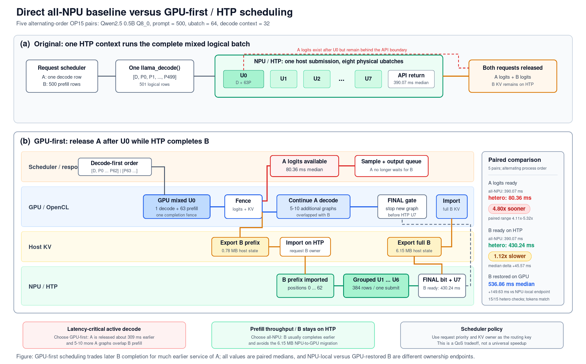

# GPU-first heterogeneous ubatch prototype

## Verified direct result

The direct all-NPU comparison shows a real latency benefit for the active
decode request, but not a universal completion-speed benefit. On a OnePlus 15
(CPH2749, SM8850), five fresh-process pairs alternated which variant ran first.
Each pair used Qwen2.5 0.5B Instruct Q8_0, a 500-token prefill request B, one
decode row from request A, and physical ubatch 64.

- Original all-NPU returned both requests after 390.07 ms median.
- GPU-first heterogeneous scheduling made A's logits available after 80.36 ms
  median. The paired improvement was 4.80x median, or 308.80 ms saved.
- B became complete on HTP after 430.24 ms median. Against the original
  NPU-local endpoint, heterogeneous B completion was 11.65% slower at the
  paired median and slower in four of five pairs.
- Restoring B on GPU completed after 536.86 ms median. This endpoint includes a
  6.15 MB NPU-to-GPU KV migration and was 149.63 ms later than the NPU-local
  original endpoint at the paired median.
- The GPU completed 5-10 additional A decode graphs while HTP processed B.
- All ten timing processes returned `status=ok`; all output tokens matched and
  all 15 heterogeneous argmax checks passed.

The scheduler decision is therefore workload-dependent: choose GPU-first for
a latency-critical active decode request; choose all-NPU when B completion or
keeping B's KV on HTP is the objective. Request priority, latency SLO, and KV
ownership should select the path.

The direct comparison is available as a paper-style workflow and as complete
machine-readable evidence:

[Direct comparison SVG](npu_comparison.svg) |
[Direct comparison PNG](npu_comparison.png) |
[Direct comparison data](NPU_COMPARISON.json)



The earlier GPU-only-control campaign remains available separately:

[Earlier workflow SVG](system_workflow.svg) |
[Earlier workflow PNG](system_workflow.png) |
[Earlier measurements](MEASUREMENTS.json)

This is implemented in `examples/layersplit/hetero-ubatch.cpp` as the
`llama-hetero-ubatch` target. Heterogeneous mode uses two full model/context
instances because one `llama_context` fixes graph placement before entering its
internal physical-ubatch loop. `--single-device-control` loads one model and
one context on the requested device and executes the original logical batch in
one `llama_decode` call.

## Direct all-NPU comparison

The original path submits `[A_decode, B_prefill_0, ..., B_prefill_499]` to one
HTP context. llama.cpp internally splits the 501 logical rows into eight
physical ubatches, but the host sees one `llama_decode` call and cannot consume
A's logits until that call returns. B's KV remains resident on HTP.

The heterogeneous path puts `[A_decode, B_prefill_0, ..., B_prefill_62]` in GPU
U0, releases A after the GPU completion fence, and transfers B's prefix to HTP.
HTP completes the remaining 437 B rows while the GPU continues A. Timed runs
disable placement instrumentation, and each fresh process warms the exact
logical shape and transfers used by its own path.

| Run | Process order | All-NPU A+B return | Hetero A ready | Paired A gain | Hetero B on HTP | B HTP delta | B restored on GPU |
|---:|---|---:|---:|---:|---:|---:|---:|
| 1 | NPU, hetero | 390.07 ms | 81.28 ms | 4.80x | 435.50 ms | +45.42 ms | 539.70 ms |
| 2 | Hetero, NPU | 331.07 ms | 73.93 ms | 4.48x | 379.48 ms | +48.41 ms | 418.01 ms |
| 3 | NPU, hetero | 330.60 ms | 80.36 ms | 4.11x | 430.24 ms | +99.65 ms | 536.86 ms |
| 4 | Hetero, NPU | 394.00 ms | 74.02 ms | 5.32x | 377.02 ms | -16.98 ms | 416.51 ms |
| 5 | NPU, hetero | 391.11 ms | 80.48 ms | 4.86x | 436.68 ms | +45.57 ms | 541.65 ms |
| Paired median | Alternating | 390.07 ms | 80.36 ms | 4.80x | 430.24 ms | +45.57 ms | 536.86 ms |

`B HTP delta` is heterogeneous B-ready-on-HTP time minus the all-NPU API
return in the same pair. Ratios were also calculated within each pair before
taking their median. The paired B ratio is 1.1165, so heterogeneous B is 11.65%
slower at the median. Run 4 is the one pair where heterogeneous B completed
earlier.

The B-restored-on-GPU column is useful only when GPU ownership is required. It
is not an equivalent endpoint to all-NPU, where B is already usable on HTP.
The migration added a paired median 149.63 ms over that NPU-local endpoint. A
follow-up continuation decode was faster on HTP in all five heterogeneous
runs, but the harness always tested HTP before GPU. That validation establishes
state usability and gives no evidence that migration improves next-token
latency; it is not a randomized backend benchmark.

The all-NPU timing range was 330.60-394.00 ms with 8.13% coefficient of
variation. Heterogeneous A-ready time was 73.93-81.28 ms with 4.25% coefficient
of variation. Battery temperature remained 28.7-29.1 C. Alternating process
order retains both observed runtime modes instead of selecting favorable runs.

## Schedule and ownership

The logical batch is reordered as `[A_decode, B_prefill...]`. Unified KV keeps
that row order in the explicitly submitted first physical ubatch:

```text
1. GPU U0:       [1 A decode row + 63 B prefill rows]
2. A ready:      read A logits after a real GPU completion fence
3. GPU -> NPU:   export B prefix KV through the portable sequence-state API
4. Concurrent:   GPU continues A decode while HTP processes B
5. HTP group:    queue U1 ... U6 in one logical submission, then fence once
6. Final hint:   set FINAL_NPU_UBATCH, then submit HTP U7
7. Boundary:     GPU observes the bit and launches no new decode graph
8. NPU -> GPU:   join HTP, export full B KV, and import it into the GPU context
9. Validation:   decode B once on both contexts and compare logits and argmax
```

B moves through these request-level ownership states:

```text
GPU_PREFIX -> NPU_PREFILL -> MIGRATING -> GPU_READY
```

The atomic bit is only a host scheduling hint. It does not replace device
completion. The pre-final `llama_synchronize`, final logit access, HTP thread
join, portable state export, and state import provide the real completion and
data-visibility boundaries.

## Why v4 differs from the preliminary result

The verification audit found two benchmark-design problems in the preliminary
v2/v3 measurements:

1. The graph-evaluation callback used to collect placement also forces backend
   synchronization inside the scheduler. Placement instrumentation therefore
   changed the execution being timed.
2. Submitting every HTP physical ubatch through a separate host call introduced
   an avoidable host fence per ubatch. During the uninstrumented v3 diagnosis,
   the un-warmed full NPU -> GPU state path also varied from 38 to 111 ms.

V4 separates the concerns:

- Normal timing runs have no graph-evaluation callback.
- `--placement-audit` is a separate diagnostic mode whose timing is not used.
- HTP U1 ... U6 are one logical submission containing six internal physical
  ubatches. The host fences once, sets the final bit, and submits U7 separately.
- Warmup exercises the exact GPU control shape, the exact two HTP submissions,
  the 0.78 MB prefix handoff, and the 6.15 MB full-state return handoff.

The v2 timing numbers should be treated as instrumented preliminary data. The
v4 numbers below are valid for the earlier GPU-only-control campaign, but they
are not the direct all-NPU comparison used for the scheduler decision above.

## Historical GPU-only control campaign

Model: Qwen2.5 0.5B Instruct Q8_0. Parameters: prompt 500, decode context 32,
physical ubatch 64, maximum concurrent decode steps 64, and `-ngl 99`.

Each row is one fresh process using schema `hetero-ubatch-v4`. Placement audit
was disabled in all five timing processes.

This campaign compared heterogeneous completion with an all-GPU mixed batch.
It reported a 1.99x paired median B completion gain because four GPU controls
ran near 906 ms. In the later direct all-NPU campaign, the all-GPU control ran
at 608.13 ms median and heterogeneous B reached GPU at 536.86 ms median, a
1.13x paired gain. Both are observed device modes, but the 1.99x value is not
an invariant scheduler speedup and must not be compared with the all-NPU
endpoint.

| Metric | Run 1 | Run 2 | Run 3 | Run 4 | Run 5 | Median |
|---|---:|---:|---:|---:|---:|---:|
| GPU-only mixed batch | 906.30 ms | 906.66 ms | 906.94 ms | 906.61 ms | 586.96 ms | 906.61 ms |
| Heterogeneous decode ready | 110.90 ms | 110.62 ms | 111.64 ms | 111.05 ms | 73.70 ms | 110.90 ms |
| Decode-ready speedup | 8.17x | 8.20x | 8.12x | 8.16x | 7.96x | 8.16x |
| B ready on HTP | 417.30 ms | 414.97 ms | 414.75 ms | 415.63 ms | 376.32 ms | 414.97 ms |
| B KV restored on GPU | 458.07 ms | 455.63 ms | 454.68 ms | 453.54 ms | 416.17 ms | 454.68 ms |
| Per-run completion speedup | 1.98x | 1.99x | 1.99x | 2.00x | 1.41x | 1.99x |
| GPU decode steps overlapped | 10 | 10 | 10 | 10 | 10 | 10 |
| Final GPU boundary overrun | 2.13 ms | 2.17 ms | 2.19 ms | 2.18 ms | 2.16 ms | 2.17 ms |

Run 5 appears to have entered a faster GPU performance mode: both its GPU-only
control and GPU U0 were about one third faster. Frequency counters were not
collected, so this is an inference from the paired timings. The run is not
discarded. It makes the absolute GPU timings bimodal, but the paired
decode-ready ratio remains stable: its coefficient of variation is 1.02%
across the five runs. Phone battery temperatures before the runs were 35.7,
35.8, 35.8, 35.6, and 35.6 C.

The HTP and handoff stages were substantially more stable:

- Grouped U1 ... U6: 250.07 ms median, 248.23-250.92 ms, CV 0.37%.
- Final U7: 49.97 ms median, 47.77-51.10 ms, CV 2.29%.
- GPU -> NPU prefix state: 1.84 ms median, 1.70-2.06 ms.
- NPU -> GPU full state: 37.69 ms median, 35.69-38.59 ms.
- Final GPU boundary overrun: 2.17 ms median, 2.13-2.19 ms.

Medians and ranges are reported rather than selecting the best device mode.
The completion speedup is calculated within each run before taking its median.
The control performs one A decode row plus B prefill; the treatment reaches B's
GPU-ready state while also completing 10 additional A decode graphs.

## Historical campaign timeline

The following values are marginal medians over the five runs, so component
medians do not necessarily add exactly to the median end-to-end value:

```text
time 0 ms
  |
  +-- OpenCL U0: A decode row + 63 B prefill rows
  |      A logits available:                   110.90 ms
  |
  +-- B prefix KV OpenCL -> host -> HTP
  |      775,500 bytes:                          1.84 ms
  |
  +-- concurrent region
  |      HTP U1 ... U6: 384 rows, one submit   250.07 ms
  |      OpenCL: 10 additional A decode graphs
  |
  +-- set FINAL_NPU_UBATCH, then submit U7
  |      HTP U7: 53 rows                         49.97 ms
  |      B logits ready on HTP:                 414.97 ms
  |
  +-- wait for any in-flight GPU token boundary
  |      boundary overrun:                        2.17 ms
  |
  +-- full B KV HTP -> host -> OpenCL
  |      6,150,600 bytes:                        37.69 ms
  |      B state restored on GPU:               454.68 ms
  |
  +-- GPU-only mixed logical batch control:     906.61 ms
```

## Correctness and placement evidence

Three checks ran in every measured process:

1. GPU full-batch U0 logits versus the separately submitted GPU U0 logits.
2. GPU-only B prefill logits versus GPU-prefix plus HTP-remainder B logits.
3. HTP continuation logits versus continuation after importing B's KV on GPU.

All 15 argmax checks passed. The first GPU U0 was exactly equal in all runs
(relative L2 0). Cross-backend logits were not bit-identical: relative L2 was
2.90% at B prefill completion and 3.29% for the continuation token. Matching
argmax establishes token-level agreement for this deterministic test, not
general numerical equivalence for arbitrary prompts.

In the direct comparison, every all-NPU run and every heterogeneous run emitted
decode token 71703 and prefill token 198. All ten processes returned
`status=ok`, and the heterogeneous continuation token was 220 on both HTP and
GPU in all five runs.

One separate `--placement-audit` process passed the same three checks and
reported 99.81% of GPU-context compute nodes on OpenCL buffers and 99.63% of
NPU-context compute nodes on HTP buffers. The JSON labels this evidence as
`scheduled_graph_node_buffers`. It verifies llama.cpp's scheduled graph
placement; it is not a hardware execution counter, utilization measurement, or
FLOP share. Its instrumented timing is intentionally excluded from the table.

A second placement-audit process exercised the new all-NPU control path. Of
9,078 scheduled compute nodes, 9,044 were on HTP0 buffers and 34 were on CPU
buffers, for a 99.63% target fraction. Its instrumented 370.12 ms result is
excluded from timing comparisons.

## Code verification

The implementation audit checked these invariants:

- `--single-device-control` loads exactly one model and one context on the
  selected device, constructs one 501-row mixed logical batch, and reports the
  eight physical ubatches implied by retained ubatch 64.
- The all-NPU warmup executes the same 501-row shape as its timed call, then
  clears KV and restores only A's 32-token seed state before measurement.
- The first treatment call contains exactly one decode row followed by 63
  prefill rows and fits one retained physical ubatch.
- GPU and HTP workers use separate model/context instances. Shared result data
  is read only after thread join, while phase transitions use release/acquire
  atomics.
- HTP U1 ... U6 remain normal llama.cpp internal physical ubatches inside one
  logical call. An explicit completion fence occurs before publishing the final
  bit, so the bit cannot run ahead of queued NPU work.
- `FINAL_NPU_UBATCH` is set before HTP submits U7, allowing the GPU loop to stop
  before launching another non-preemptible token graph.
- The real final HTP completion is observed before exporting B's full KV.
- Sequence-state export/import retains B's positions and sequence ID; a
  continuation decode after migration verifies that the imported state is
  usable.
- Timed contexts have no placement callback. Placement validity is checked only
  in the explicit audit mode and requires more than 90% of scheduled compute
  nodes on each requested backend.
- Warmup uses the tested shapes and both state-transfer directions.

Host CPU timing, heterogeneous regression, and placement-audit smoke tests
passed. Both host and Android builds passed strict warning checks. The Android
source hash is
`3e2c39ebe9ef36955808fa92f6d8ccef1824bbafb85ed0547733a857ac31fbfb`,
and the tested 2,721,192-byte binary hash is
`685b21896daf9c1b4fea5c3ec2e42558a0f00f5199340d3b036796a7d7a5ac71`.

The rebuilt binary also passed a paired OP15 Stories 15M Q4_0 smoke test. The
all-NPU mixed batch took 24.69 ms; heterogeneous A was ready at 20.24 ms, B was
ready on HTP at 53.56 ms, and B was restored on GPU at 65.93 ms. Tokens matched
and all three heterogeneous checks passed. This smoke run confirms both code
paths on a smaller model; it is not an additional benchmark series.

## Reproduction

Original all-NPU timing mode, with one model/context and no placement callback:

```sh
./llama-hetero-ubatch \
  -m qwen2.5-0.5b-instruct-q8_0.gguf \
  --dev-gpu HTP0 \
  --single-device-control \
  --ubatch 64 \
  --prompt-len 500 \
  --decode-ctx 32 \
  --decode-steps 64 \
  -ngl 99
```

`--single-device-control` uses `--dev-gpu` as its one selected device; no GPU
context is created when that value is `HTP0`.

Heterogeneous timing mode, also with no placement callback:

```sh
./llama-hetero-ubatch \
  -m qwen2.5-0.5b-instruct-q8_0.gguf \
  --dev-gpu GPUOpenCL \
  --dev-npu HTP0 \
  --ubatch 64 \
  --prompt-len 500 \
  --decode-ctx 32 \
  --decode-steps 64 \
  -ngl 99
```

Heterogeneous placement audit, whose timing must not be mixed with timing-mode
results:

```sh
./llama-hetero-ubatch \
  -m qwen2.5-0.5b-instruct-q8_0.gguf \
  --dev-gpu GPUOpenCL \
  --dev-npu HTP0 \
  --ubatch 64 \
  --prompt-len 500 \
  --decode-ctx 32 \
  --decode-steps 64 \
  --placement-audit \
  -ngl 99
```

All-NPU placement audit:

```sh
./llama-hetero-ubatch \
  -m qwen2.5-0.5b-instruct-q8_0.gguf \
  --dev-gpu HTP0 \
  --single-device-control \
  --ubatch 64 \
  --prompt-len 500 \
  --decode-ctx 32 \
  --decode-steps 64 \
  --placement-audit \
  -ngl 99
```

The OP15 runtime also needs `LD_LIBRARY_PATH=.`, `ADSP_LIBRARY_PATH=.`, and the
HTP skel in that directory. These runs used `GGML_HEXAGON_MBUF=3072`. Warmup is
enabled by default; `--no-warmup` is available for diagnostic comparisons.

## Scope and limitations

- This is an experimental scheduler harness, not an HTTP server implementation.
  The measured decode-ready point is where host logits are available for
  sampling; it does not include sampling, output-queue, or network latency.
- Heterogeneous mode loads two model/context instances. A production design
  needs an explicit memory budget and admission policy. All-NPU control mode
  loads one.
- KV transfer uses the portable host sequence-state API. The final 6.15 MB
  transfer was bimodal at 36.27-102.14 ms in the direct campaign, with a 99.78
  ms median. Avoid it when B can remain on HTP.
- The GPU cannot be preempted inside one decode graph. The atomic bit only avoids
  launching the next graph when HTP has entered its final physical ubatch.
- The data covers one model, one deterministic synthetic prompt shape, one
  device, and five runs. It does not establish multi-tenant throughput, energy,
  or broad quality behavior.
- GPU, HTP, and transfer timings showed multiple performance modes. Alternating
  process order reduces fixed-order bias but is not randomization. More
  repetitions with GPU/SoC frequency and energy counters are needed for a
  paper-quality characterization.
- Backend placement is inferred from scheduled tensor buffers in a separate
  instrumented run. Hardware execution counters were not collected.

The result supports an opt-in, SLO-aware server design with two contexts and a
request-level KV-owner state machine. It does not support globally replacing
the original all-NPU path or changing backend placement inside the existing
single-context ubatch loop.
